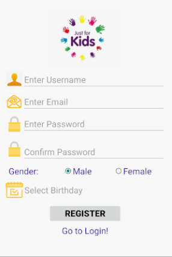
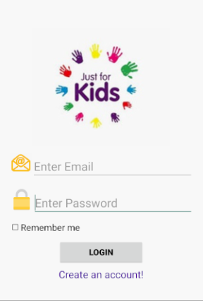
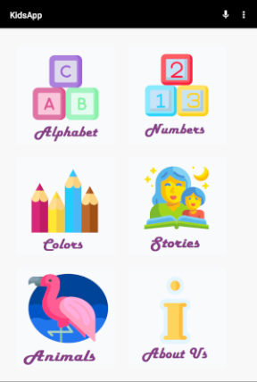

# KidsApplication

<h1>Why?</h1>

KidsApp is a mobile application for Android OS that makes kids familiar with alphabet, numbers, colors and basic things. Kids who struggle with spelling can say a word or sound it out, and then see how it’s spelled on screen. There are a lot of interesting stories to read too.

<h1>How?</h1>

KidsApp is open source and you can get it by downloading it. To use it you must create an account by filling the register form, then you can use the app whenever you want by loggin. Most of things are ilustrated, which makes this app very easy to use by children.

<h1>What?</h1>
<table>
<tr><td>Category</td><td>What?</td></tr>
<tr><td>Alphabet</td><td>English Alphabet, Vowels, Consonants</td></tr>
<tr><td>Number</td><td>Numbers from one to ten</td></tr>
<tr><td>Colors</td><td>Basic colors</td></tr>
<tr><td>Stories</td><td>Some of the most beautiful sotries</td></tr>
<tr><td>Animals</td><td>Animals classified into groups</td></tr>
<tr><td>About us</td><td>Some informations about us</td></tr>
  <tr><td>Microphone</td><td>Kids can say a word and see how it's spelled on screen</td><tr>
</table>

